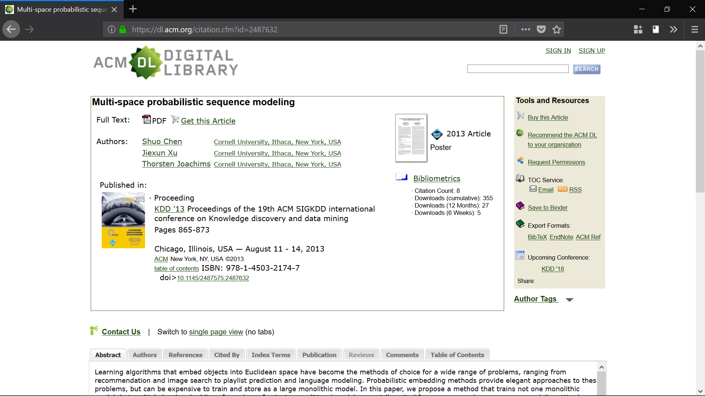
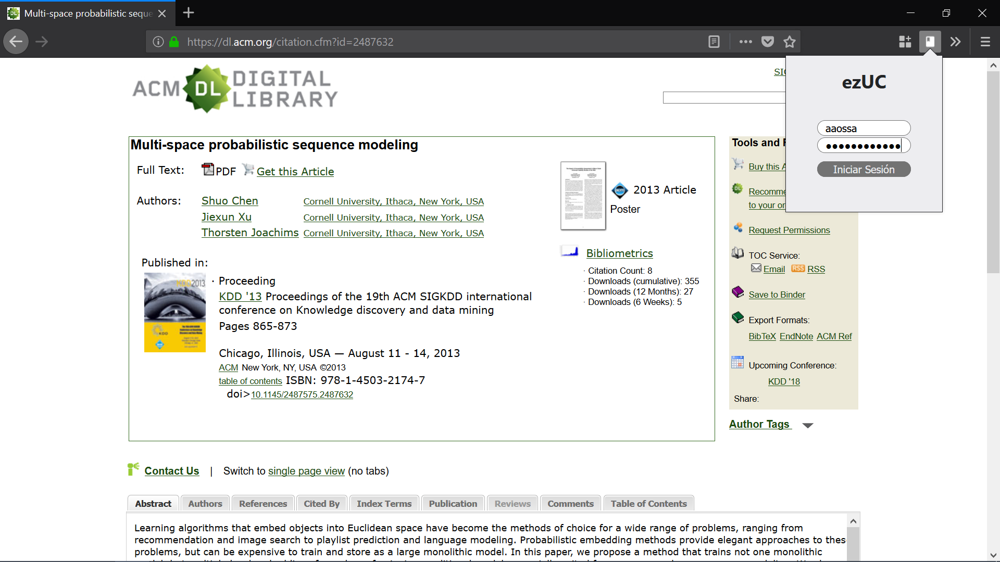
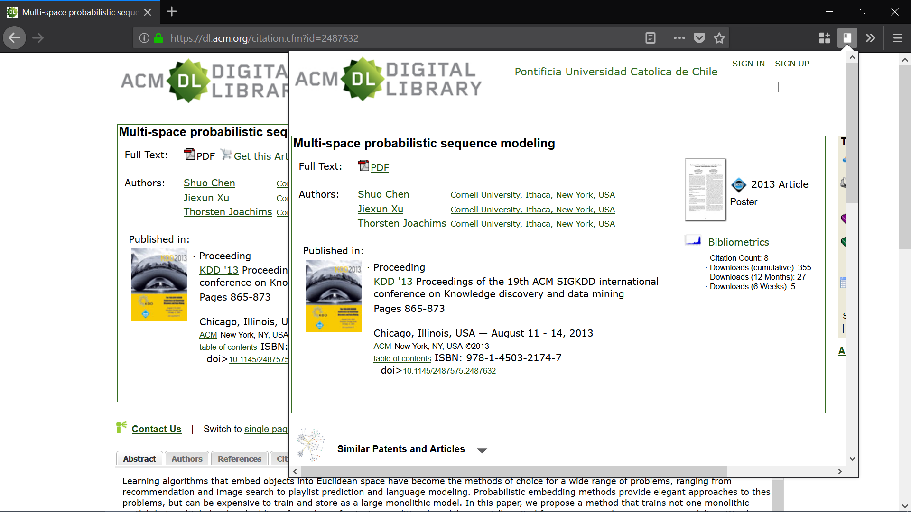

# ezUC Firefox add-on
Firefox add-on to load current tab through EZproxy (UC only)

> Work in progress

## Step by step

#### 1. Find a paywalled paper (ACM, Springer, etc.)

#### 2. Use your UC credentials (UC is short for "Pontificia Universidad Católica de Chile")

#### 3. Skip the paywall and enjoy free access

## Future steps

- [ ] **Feature**: Open popup in new or current tab
- [ ] **Feature**: Port to Chrome (should be "easy")
- [ ] **Feature**: Improve stylef
- [ ] **Feature**: Custom error page
- [ ] **Research**: Save credentials
- [ ] **Research**: List pages
- [ ] **Research**: Publish on Firefox Add-ons
- [ ] **Idea**: Connect with (or provide) container by default